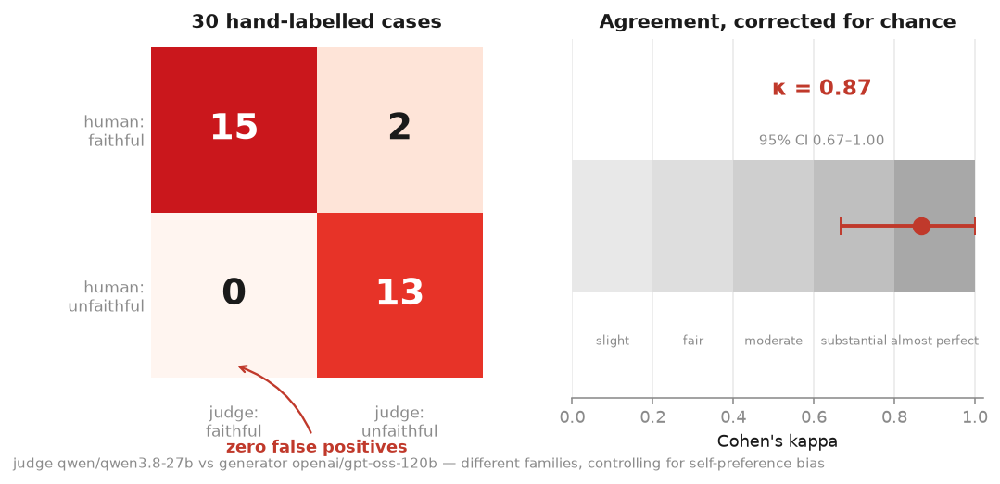
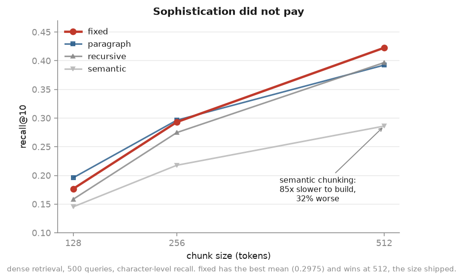
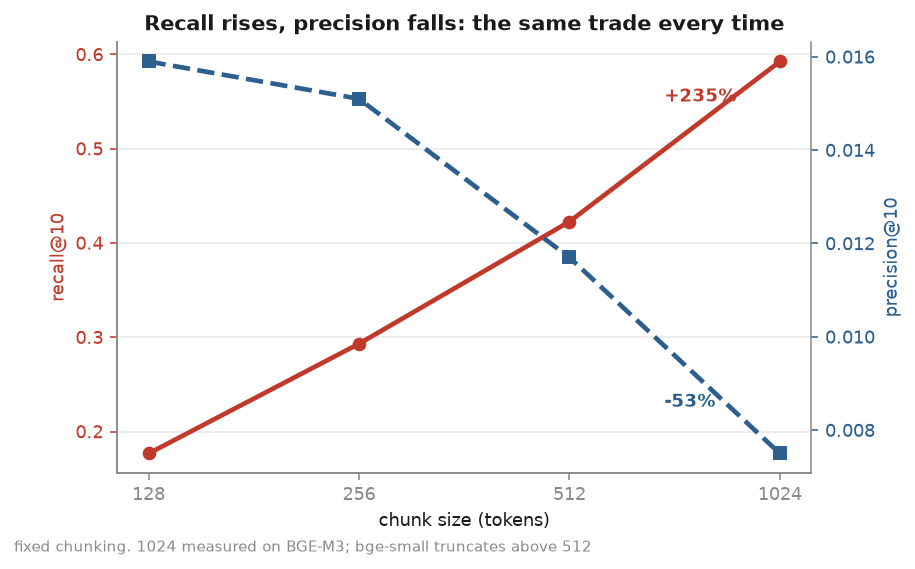
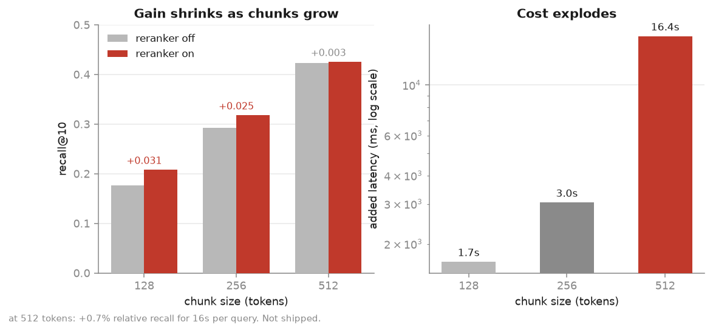

# RAG Evaluation Harness — Legal Contract QA

Character-level retrieval evaluation and calibrated LLM-as-judge faithfulness scoring
over [LegalBench-RAG](https://github.com/zeroentropy-ai/legalbenchrag): 714 contracts,
6,698 expert-annotated queries, 10,637 gold spans.

**The judge is validated before its scores are reported.** Cohen's κ = 0.87 (95% CI
0.67–1.00) against 30 stratified human labels, zero false positives.

---

## Results

**Retrieval** — `fixed` chunking, 500 stratified queries, character-level scoring,
`bge-small-en-v1.5` with exact cosine search

At the shipping configuration, 512 tokens:

| retriever | recall@10 | precision@10 | MRR@10 | NDCG@10 | p50 |
|---|---|---|---|---|---|
| BM25 | 0.390 | 0.0097 | 0.196 | 0.257 | 281 ms |
| **dense** | **0.423** | **0.0117** | **0.224** | **0.284** | **16 ms** |

Hybrid was measured in the three-way comparison at 256 tokens, where RRF gains recall and
loses ranking — see [finding 3](#3-rrf-amplifies-shared-error):

| retriever @ 256 | hit@10 | recall@10 | precision@10 | MRR@10 | NDCG@10 |
|---|---|---|---|---|---|
| BM25 | 0.300 | 0.220 | 0.0099 | 0.109 | 0.154 |
| dense | 0.378 | 0.293 | 0.0151 | **0.163** | **0.211** |
| hybrid (RRF) | **0.388** | **0.305** | 0.0141 | 0.138 | 0.197 |

**Generation** — Groq `openai/gpt-oss-120b`, top-10 context, DROP packing at a
5,100-token budget

| | |
|---|---|
| faithfulness | **41/50 (82%)** |
| answerable | 36/45 (80%) |
| unanswerable (provable negatives) | **5/5 (100%)** |
| cost per query | $0.00096 generation · $0.0004 judging |
| judge calls avoided by deterministic precheck | 56% |

**Judge calibration** — `qwen/qwen3.8-27b` vs generator `openai/gpt-oss-120b`,
different model families

| | judge: faithful | judge: unfaithful |
|---|---|---|
| **human: faithful** | 15 | 2 |
| **human: unfaithful** | **0** | 13 |

κ = 0.8667 · raw agreement 93.3% · bootstrap 95% CI 0.6667–1.0000 · verbosity
correlation r = −0.57 (confounded with stratum design, see
[limitations](#limitations))



---

## Findings

### 1. Sophisticated chunking did not pay



4 strategies × 3 sizes × 2 retrievers, reranker off to keep the effect attributable.

| strategy | mean recall@10 (dense) | chunking time @ 512 |
|---|---|---|
| **fixed** | **0.2975** | **55 s** |
| paragraph | 0.2949 | 294 s |
| recursive | 0.2767 | 764 s |
| semantic | 0.2164 | **4,653 s** |

Embedding-similarity chunking was worst at every size and **85× more expensive to
build** than fixed-size splitting. The cost is structural, not an implementation
detail: every sentence in the corpus is embedded to find topic boundaries, then every
resulting chunk is embedded again for retrieval.

A pre-registered prediction that the strategies would converge at 128 tokens was
**wrong in the opposite direction** — the spread widens with size (0.051 → 0.079 →
0.137). At a tight budget the chunks are too short to contain a gold span regardless of
where the boundaries fall, so strategy cannot express itself.

### 2. Recall gains are paid for in precision



| chunk size | recall@10 | precision@10 | preamble rate |
|---|---|---|---|
| 128 | 0.177 | 0.0159 | 44.6% |
| 256 | 0.293 | 0.0151 | 54.4% |
| 512 | 0.423 | 0.0117 | 64.0% |
| 1024 (BGE-M3) | 0.592 | 0.0075 | 76.2% |

Precision is computed over characters, so its denominator scales directly with chunk
size while the numerator barely moves. **Chunk-level scoring would have shown recall
rising and hidden this entirely** — which is why the metrics are implemented at
character level rather than taken from a library.

The reading rule: recall up with precision flat or falling means the chunks got bigger,
not smarter. Recall up *and* precision up is genuine improvement. That happened exactly
once in this project — BGE-M3 reading a full 1024-token chunk against bge-small reading
the first 512 of the same chunk.

### 3. RRF amplifies shared error

Hybrid retrieval gained recall (+0.012) and **lost MRR (−15%) and NDCG (−7%)** against
dense alone.

Both retrievers rank document preambles highly — BM25 because the query's party names
are densest there, dense because the query embedding is dominated by the same names.
RRF sums those votes and promotes preamble chunks above chunks only one method found.
Agreement amplifies shared error as readily as shared correctness.

The ceiling is structural: for **55.8% of queries neither retriever returned any gold
text**, so fusion has nothing to reorder. Union recall is 44.2%, against hybrid's 30.5%
— no amount of RRF tuning closes a gap that size.

### 4. A general-purpose reranker does not earn its latency



`bge-reranker-base`, 50 candidates → top 10:

| chunk size | Δ recall@10 | headroom captured | added latency |
|---|---|---|---|
| 128 | +0.0312 | 20.5% | 1.7 s |
| 256 | +0.0247 | 12.7% | 3.0 s |
| **512** | **+0.0028** | **1.8%** | **16.4 s** |

At the shipping configuration: **+0.7% relative recall for 1,200× the latency**, while
losing 6% of MRR and 6% of precision. Headroom is recall@50 of the first stage minus
recall@10 without reranking — the most a perfect reranker could recover. Reporting the
delta without it would hide that 512 captures an eighth of what 128 does against
near-identical headroom.

This reproduces the LegalBench-RAG authors' Cohere result with a different model,
which strengthens it. It is also the only intervention that moved the preamble rate
(−10 points at every size) — a mitigation that works and still is not worth shipping.

### 5. Document selection and passage retrieval are separate problems

Every query carries a `Consider [document description]; [question]` prefix — **61% of
the query text**. Three arms on identical chunks:

| arm | recall@10 | precision@10 | rank-1 in correct doc | distinct docs in top 10 |
|---|---|---|---|---|
| full query | 0.423 | 0.0117 | 85.6% | 5.64 |
| prefix stripped | **0.025** | 0.0019 | **1.6%** | **9.51** |
| oracle doc filter | **0.697** | **0.0258** | 99.8% | **1.00** |

Stripping the prefix eliminated the preamble bias (64% → 0.4%) and **collapsed recall by
94%**. The party names cause the bias *and* supply the only document signal.

Restricting search to the correct document — an oracle, using the answer key — lifts
recall 65% and doubles precision. One similarity score is being asked to answer "is this
the right document?" and "is this the right passage?" simultaneously, and those pull in
opposite directions: party names identify the document and live in the preamble;
question terms identify the passage and appear in all 714 contracts.

**The fix is architectural, not a query edit.** Filter to a document, then retrieve
within it, with each stage scored independently so a regression points at the stage that
caused it. Out of scope here; the oracle measures what it would be worth.

### 6. Refusal behaviour is condition-dependent, not a property of the model

| condition | refusal rate |
|---|---|
| retrieval returned no gold (chunks visibly off-topic) | **88%** |
| query names a document retrieval never returned | **0%** |

Both mean no answer is available. When retrieval fails, the chunks are visibly unrelated
and the model declines. When the context looks appropriate — right domain, plausible
clauses, real section numbers — it answers from adjacent material.

**Not fabrication. Over-application of real context**, which is harder to detect because
every quotation is genuine.

---

## Method

**Ground truth verified before use.** 10,928 gold spans sliced from source and compared
against stored answers. First pass: **74% matched.** Cause was CRLF handling — the corpus
stores Windows line endings and preserving them shifted every offset by one character per
preceding line break. After correcting: **100% of reachable spans.** 17 documents are
unreachable on Windows (filenames contain `|`); the 191 queries touching them are dropped
whole rather than scored against an impossible denominator.

**Metrics implemented at character level, not chunk level.** A 512-token chunk is
mechanically more likely to overlap a gold span than a 128-token chunk, so chunk-level
recall rises with chunk size as a measurement artifact. Scoring over characters —
`recall = gold chars retrieved / gold chars total`, `precision = gold chars retrieved /
chars returned` — makes configurations comparable. 61 known-answer unit tests, expected
values computed by hand before the code was written, NDCG cross-checked against
`sklearn.metrics.ndcg_score` on binary relevance.

**Exact search for measurement, not an approximate index.** HNSW has its own recall below
1.0; measuring chunking through it would mix method error with index error inseparably.
At 32k chunks × 384 dims the full matrix is under 100 MB and exhaustive search takes
16 ms.

**Context packing chosen by measurement.** Groq's free tier caps requests at 8,000 TPM,
and 64% of queries exceed the budget at top-10. DROP (whole chunks in rank order) vs
TRUNCATE (all chunks, each cut proportionally), simulated over the golden set with no LLM
calls:

| policy | recall@10 | precision@10 | mean chars |
|---|---|---|---|
| no limit | 0.3816 | 0.0072 | 23,168 |
| **DROP** | **0.3816** | **0.0078** | **23,168** |
| TRUNCATE | 0.3802 | 0.0072 | 24,732 |

DROP costs nothing — identical recall to no limit, 8% better precision, 6% fewer
characters. The gold was never in chunk 10.

**Unanswerable cases are provable negatives.** A first construction repointed contract
questions at other contracts where the benchmark recorded no annotated span of that type.
That was unsound: CUAD annotates 41 categories and a document labelled for 19 was only
*checked* for those 19. Absence of a label is not absence of a clause. Rebuilt by
cross-domain repointing — a contract question pointed at a mobile app privacy policy,
which has no parties, no clauses and no governing law by construction. The result flipped
from 0/5 refused to 4/5.

**Judge calibrated before its scores are used.** Three failure modes in the rubric, all
found by hand-labelling: unsupported claims, contradicted claims, and **unsupported
absence** — "there is no X" asserted from ten fragments of a 300 KB contract. Five of the
nine faithfulness failures were the third type; a rubric without it would have reported
92% instead of 82%.

---

## Reproduce

```
docker compose up
```

Runs 71 tests — 61 metric unit tests and 10 regression assertions against
`results/baseline.json`. No corpus, no API key, no network required.

Full pipeline (needs the corpus and a Groq key in `.env`):

```
docker compose run --rm retrieval    # Phase 5 sweep
docker compose run --rm generate     # answers, resumable
docker compose run --rm judge        # faithfulness scoring
docker compose run --rm charts       # rebuild figures
```

Locally with [uv](https://docs.astral.sh/uv/):

```
uv sync
uv run pytest tests/ -v
```

**Corpus** from the [LegalBench-RAG repository](https://github.com/zeroentropy-ai/legalbenchrag)
into `data/corpus` and `data/benchmarks`. Not redistributed here — see
[data](#data-and-licensing).

---

## Architecture

```
question
   ↓
dense retrieval — bge-small-en-v1.5, exact cosine over 32,240 chunks    16 ms
   ↓
context packing — DROP in rank order, 5,100-token budget
   ↓
generation — openai/gpt-oss-120b, prompts/v1/qa.yaml                  ~1.4 s
   ↓
faithfulness — qwen/qwen3.8-27b, prompts/v1/judge_faithfulness.yaml
               deterministic precheck resolves 56% without a call
```

| | |
|---|---|
| `src/rag_eval_harness/metrics/` | five retrieval metrics, character-level, hand-implemented |
| `src/rag_eval_harness/chunking/` | fixed, recursive, paragraph, semantic — all tile exactly |
| `src/rag_eval_harness/retrieval/` | BM25, dense, RRF hybrid, cross-encoder reranker |
| `src/rag_eval_harness/judge.py` | faithfulness rubric with the three failure types |
| `prompts/v1/` | versioned prompts; the judge's carries its own calibration |
| `results/baseline.json` | CI gate reference, with prompt fingerprints |

Every run writes `results/runs/<hash>/manifest.json` — git SHA, dirty flag, config hash,
package versions. Prompt text is part of the LLM cache key, so editing a prompt
invalidates exactly the cached calls it affects.

**CI** asserts faithfulness and retrieval recall against the baseline, and fails
separately on prompt-version or judge-model drift, because a score produced under a
different rubric is not comparable to one that is not. A deliberate 13-point regression
fails the build with the metric named.

---

## Limitations

**30 human labels is a small sample.** The bootstrap CI is 0.67–1.00. The point estimate
is strong; the interval is what 30 cases can honestly support.

**Verbosity correlation r = −0.57 is confounded with the stratum design.** The 10
corrupted cases were drawn from assertive answers, which run long; refusals are short.
Length correlates with the stratum, not necessarily with the judge's reasoning. Reported
as measured.

**Latency compares implementations, not algorithms.** `rank_bm25` scores every chunk in
Python with no inverted index. A Lucene-backed BM25 would be 1–5 ms and would beat dense.
The dense figure is meaningful; the BM25 one is a floor.

**Both judge disagreements were human inconsistency.** The human applied the
unsupported-absence rule in two cases and not in two others; the judge applied it in all
four. The labels remain the reference point, but the drift is recorded rather than hidden.

**pgvector HNSW was not measured.** The plan included quantifying approximate-index recall
loss against exact search. All retrieval here is exact numpy, so the comparison is noted
as unfinished rather than implied.

---

## Data and licensing

Metrics, query IDs, character offsets and retrieval results are published. **Contract text
is not.** The LegalBench-RAG repository is MIT, but its documents come from ContractNLI,
CUAD, MAUD and PrivacyQA, each with its own usage policy, and redistribution rights could
not be established.

`scripts/sanitise_evals.py` strips text fields from the evaluation files, keeping
`(doc_id, start, end)`. Nothing is lost: that is how the harness reads spans, and Phase 1
verified 10,637 resolve correctly from offsets alone. `--reconstruct` restores the text
locally from a downloaded corpus.

---

## Stack

Python 3.12 · uv · numpy · sentence-transformers · rank-bm25 · Groq · pytest · Docker

No LangChain, no LlamaIndex, no RAGAS. The retrieval loop is ~200 lines and the metrics
are hand-implemented, because the point of the project is being able to defend every
number rather than delegate it.
